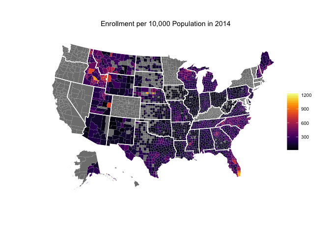
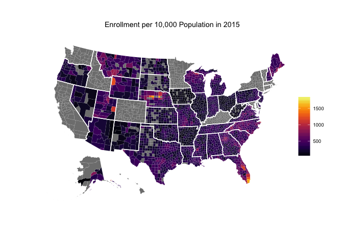

<!-- README.md is generated from README.Rmd. Please edit that file -->
[](https://travis-ci.org/jjchern/qhp)

About
=====

This package includes Qualified Health Plan (qhp) data in the Health Insurance Marketplace. So far it contains three years of enrollment data and the initial health plan data.

Installation
============

``` r
# install.packages("devtools")
devtools::install_github("jjchern/qhp")
```

Links
=====

General
-------

-   [ASPE AFFORDABLE CARE ACT RESEARCH](http://aspe.hhs.gov/affordable-care-act-research)

Sources
-------

-   [PLAN SELECTIONS BY ZIP CODE IN THE HEALTH INSURANCE MARKETPLACE, 2014](http://aspe.hhs.gov/plan-selections-zip-code-health-insurance-marketplace-september-2014)
-   [PLAN SELECTIONS BY ZIP CODE IN THE HEALTH INSURANCE MARKETPLACE, 2015](http://aspe.hhs.gov/plan-selections-zip-code-health-insurance-marketplace-april-2015)
-   [PLAN SELECTIONS BY ZIP CODE AND COUNTY IN THE HEALTH INSURANCE MARKETPLACE: MARCH 2016](https://aspe.hhs.gov/basic-report/plan-selections-zip-code-and-county-health-insurance-marketplace-march-2016)
-   [HEALTH PLAN DATASETS](https://www.healthcare.gov/health-and-dental-plan-datasets-for-researchers-and-issuers/)

Inital Enrollment Data
----------------------

-   [HEALTH INSURANCE MARKETPLACE: SUMMARY ENROLLMENT REPORT FOR THE INITIAL ANNUAL OPEN ENROLLMENT PERIOD](https://aspe.hhs.gov/report/health-insurance-marketplace-summary-enrollment-report-initial-annual-open-enrollment-period)
-   [ADDENDUM TO THE HEALTH INSURANCE MARKETPLACE SUMMARY ENROLLMENT REPORT FOR THE INITIAL ANNUAL OPEN ENROLLMENT PERIOD](https://aspe.hhs.gov/sites/default/files/pdf/93351/ib_2014Apr_enrollAddendum.pdf)

Second Enrollment Data
----------------------

-   [QHP Selections by Age Groups](https://data.healthcare.gov/dataset/2015-Qualifying-Health-Plan-Selections-by-Age-Grou/qv54-6mtm)
-   [QHP Selections by APTC](https://data.healthcare.gov/dataset/2015-Qualifying-Health-Plan-Selections-by-APTC-and/f7yt-nc7m)
-   [QHP Selections by Household Incomes](https://data.healthcare.gov/dataset/2015-Qualifying-Health-Plan-Selections-by-Househol/sy6b-59wj)
-   [QHP Selections by Race/ethnicity](https://data.healthcare.gov/dataset/2015-Qualifying-Health-Plan-Selections-by-Race-Eth/dvpf-jb7v)
-   [QHP Selections by Types of Selections](https://data.healthcare.gov/dataset/2015-Qualifying-Health-Plan-Selections-by-Type-of-/kjvw-ka5c)
-   [QHP Selections by CSR](https://data.healthcare.gov/dataset/2015-Qualifying-Health-Plan-Selections-by-CSR-and-/ncbw-vdsn)
-   [QHP Selections by Metal Levels](https://data.healthcare.gov/dataset/2015-Qualifying-Health-Plan-Selections-by-Metal-Le/d89b-9897)

Usage
=====

Zip Code Level Enrollment Data
------------------------------

``` r
library(dplyr, warn.conflicts = FALSE)
qhp::enrollment2014
#> Source: local data frame [29,685 x 8]
#> 
#>    ZipCode     StateName PlanSelections  zcta state countygeoid
#>      <int>         <chr>          <int> <int> <chr>       <int>
#> 1     3031 New Hampshire            332  3031    NH       33011
#> 2     3032 New Hampshire            150  3032    NH       33015
#> 3     3033 New Hampshire            151  3033    NH       33011
#> 4     3034 New Hampshire            122  3034    NH       33015
#> 5     3036 New Hampshire            147  3036    NH       33015
#> 6     3037 New Hampshire            174  3037    NH       33015
#> 7     3038 New Hampshire            945  3038    NH       33015
#> 8     3040 New Hampshire             NA  3034    NH       33015
#> 9     3041 New Hampshire             NA  3038    NH       33015
#> 10    3042 New Hampshire            195  3042    NH       33015
#> ..     ...           ...            ...   ...   ...         ...
#> Variables not shown: countyname <chr>, copop <int>.
qhp::enrollment2015
#> Source: local data frame [14,619 x 8]
#> 
#>    ZipCode     StateName PlanSelections  zcta state countygeoid
#>      <int>         <chr>          <int> <int> <chr>       <int>
#> 1     3031 New Hampshire            471  3031    NH       33011
#> 2     3032 New Hampshire            215  3032    NH       33015
#> 3     3033 New Hampshire            228  3033    NH       33011
#> 4     3034 New Hampshire            203  3034    NH       33015
#> 5     3036 New Hampshire            202  3036    NH       33015
#> 6     3037 New Hampshire            226  3037    NH       33015
#> 7     3038 New Hampshire           1237  3038    NH       33015
#> 8     3042 New Hampshire            253  3042    NH       33015
#> 9     3043 New Hampshire             79  3043    NH       33011
#> 10    3044 New Hampshire            172  3044    NH       33015
#> ..     ...           ...            ...   ...   ...         ...
#> Variables not shown: countyname <chr>, copop <int>.
qhp::enrollment2016
#> Source: local data frame [15,198 x 7]
#> 
#>    ZipCode PlanSelections  zcta state countygeoid          countyname
#>      <int>          <int> <int> <chr>       <int>               <chr>
#> 1     3031            511  3031    NH       33011 Hillsborough County
#> 2     3032            241  3032    NH       33015   Rockingham County
#> 3     3033            231  3033    NH       33011 Hillsborough County
#> 4     3034            203  3034    NH       33015   Rockingham County
#> 5     3036            193  3036    NH       33015   Rockingham County
#> 6     3037            208  3037    NH       33015   Rockingham County
#> 7     3038           1367  3038    NH       33015   Rockingham County
#> 8     3042            321  3042    NH       33015   Rockingham County
#> 9     3043             84  3043    NH       33011 Hillsborough County
#> 10    3044            180  3044    NH       33015   Rockingham County
#> ..     ...            ...   ...   ...         ...                 ...
#> Variables not shown: copop <int>.
```

Top 10 Counties, Sorted According to Total Enrollment
-----------------------------------------------------

``` r
# 2014
qhp::enrollment2014 %>% 
  na.omit() %>% 
  group_by(countygeoid) %>% 
  summarise(countyname = first(countyname),
            enrollment = sum(PlanSelections),
            state = first(state),
            copop = first(copop)) %>% 
  arrange(desc(enrollment))
#> Source: local data frame [2,237 x 5]
#> 
#>    countygeoid          countyname enrollment state   copop
#>          <int>               <chr>      <int> <chr>   <int>
#> 1        12086   Miami-Dade County     256975    FL 2496435
#> 2        12011      Broward County     152745    FL 1748066
#> 3        48201       Harris County     139424    TX 4092459
#> 4        17031         Cook County     100984    IL 5194675
#> 5        48113       Dallas County      85768    TX 2368139
#> 6         4013     Maricopa County      77729    AZ 3817117
#> 7        12099   Palm Beach County      75851    FL 1320134
#> 8        12095       Orange County      66862    FL 1145956
#> 9        48029        Bexar County      61539    TX 1714773
#> 10       42101 Philadelphia County      60724    PA 1526006
#> ..         ...                 ...        ...   ...     ...

# 2015
qhp::enrollment2015 %>% 
  na.omit() %>% 
  group_by(countygeoid) %>% 
  summarise(countyname = first(countyname),
            enrollment = sum(PlanSelections),
            state = first(state),
            copop = first(copop)) %>% 
  arrange(desc(enrollment))
#> Source: local data frame [2,425 x 5]
#> 
#>    countygeoid        countyname enrollment state   copop
#>          <int>             <chr>      <int> <chr>   <int>
#> 1        12086 Miami-Dade County     392071    FL 2496435
#> 2        48201     Harris County     228358    TX 4092459
#> 3        12011    Broward County     221918    FL 1748066
#> 4        17031       Cook County     155294    IL 5194675
#> 5        12099 Palm Beach County     136989    FL 1320134
#> 6        48113     Dallas County     130814    TX 2368139
#> 7         4013   Maricopa County     129625    AZ 3817117
#> 8        12095     Orange County     111125    FL 1145956
#> 9        48029      Bexar County      93833    TX 1714773
#> 10       48439    Tarrant County      91381    TX 1809034
#> ..         ...               ...        ...   ...     ...
```

Top 10 Counties, Sorted According to Enrollment per 10,000 Residents
--------------------------------------------------------------------

``` r
# 2014
qhp::enrollment2014 %>% 
  na.omit() %>% 
  group_by(countygeoid) %>% 
  summarise(countyname = first(countyname),
            enrollment = sum(PlanSelections),
            state = first(state),
            copop = first(copop)) %>% 
  mutate(enroll_per100000 = enrollment / copop * 10000) %>% 
  filter(copop >= 100000) %>% 
  arrange(desc(enroll_per100000))
#> Source: local data frame [425 x 6]
#> 
#>    countygeoid        countyname enrollment state   copop enroll_per100000
#>          <int>             <chr>      <int> <chr>   <int>            <dbl>
#> 1        12086 Miami-Dade County     256975    FL 2496435        1029.3679
#> 2        12011    Broward County     152745    FL 1748066         873.7942
#> 3        12097    Osceola County      18655    FL  268685         694.3075
#> 4        16019 Bonneville County       6427    ID  104234         616.5934
#> 5        12095     Orange County      66862    FL 1145956         583.4604
#> 6        12099 Palm Beach County      75851    FL 1320134         574.5705
#> 7        37021   Buncombe County      13567    NC  238318         569.2814
#> 8        28049      Hinds County      13648    MS  245285         556.4140
#> 9        13089     DeKalb County      37971    GA  691893         548.7987
#> 10       13135   Gwinnett County      42625    GA  805321         529.2920
#> ..         ...               ...        ...   ...     ...              ...

# 2015
qhp::enrollment2015 %>% 
  na.omit() %>% 
  group_by(countygeoid) %>% 
  summarise(countyname = first(countyname),
            enrollment = sum(PlanSelections),
            state = first(state),
            copop = first(copop)) %>% 
  mutate(enroll_per100000 = enrollment / copop * 10000) %>% 
  filter(copop >= 100000) %>% 
  arrange(desc(enroll_per100000))
#> Source: local data frame [432 x 6]
#> 
#>    countygeoid        countyname enrollment state   copop enroll_per100000
#>          <int>             <chr>      <int> <chr>   <int>            <dbl>
#> 1        12086 Miami-Dade County     392071    FL 2496435        1570.5236
#> 2        12011    Broward County     221918    FL 1748066        1269.5058
#> 3        12097    Osceola County      31642    FL  268685        1177.6616
#> 4        12099 Palm Beach County     136989    FL 1320134        1037.6901
#> 5        12095     Orange County     111125    FL 1145956         969.7144
#> 6        37021   Buncombe County      20936    NC  238318         878.4901
#> 7        13135   Gwinnett County      69010    GA  805321         856.9254
#> 8        13089     DeKalb County      56580    GA  691893         817.7565
#> 9        28049      Hinds County      19949    MS  245285         813.2988
#> 10       12111  St. Lucie County      22078    FL  277789         794.7759
#> ..         ...               ...        ...   ...     ...              ...
```

Enrolloment per 10,000 Residents by counties
--------------------------------------------



Total enrollment by states
--------------------------

``` r
# 2014
qhp::enrollment2014 %>% 
  na.omit() %>% 
  group_by(state) %>% 
  summarise(statename = first(StateName),
            enrollment = sum(PlanSelections)) %>% 
  arrange(enrollment %>% desc) %>% 
  print(n = 36)
#> Source: local data frame [36 x 3]
#> 
#>    state      statename enrollment
#>    <chr>          <chr>      <int>
#> 1     FL        Florida     979721
#> 2     TX          Texas     719657
#> 3     NC North Carolina     352841
#> 4     GA        Georgia     311072
#> 5     PA   Pennsylvania     302288
#> 6     MI       Michigan     265480
#> 7     VA       Virginia     208011
#> 8     IL       Illinois     204256
#> 9     NJ     New Jersey     159331
#> 10    TN      Tennessee     146091
#> 11    OH           Ohio     143967
#> 12    MO       Missouri     141734
#> 13    WI      Wisconsin     132678
#> 14    IN        Indiana     124649
#> 15    AZ        Arizona     117842
#> 16    SC South Carolina     115358
#> 17    LA      Louisiana      96688
#> 18    AL        Alabama      92273
#> 19    UT           Utah      82010
#> 20    ID          Idaho      73452
#> 21    OK       Oklahoma      62815
#> 22    MS    Mississippi      56546
#> 23    KS         Kansas      49616
#> 24    ME          Maine      39600
#> 25    NH  New Hampshire      38441
#> 26    AR       Arkansas      37155
#> 27    NE       Nebraska      35780
#> 28    MT        Montana      32704
#> 29    NM     New Mexico      28981
#> 30    IA           Iowa      20527
#> 31    DE       Delaware      13745
#> 32    WV  West Virginia      13191
#> 33    AK         Alaska      11898
#> 34    WY        Wyoming      10226
#> 35    SD   South Dakota       9448
#> 36    ND   North Dakota       6650

# 2015
qhp::enrollment2015 %>% 
  na.omit() %>% 
  group_by(state) %>% 
  summarise(statename = first(StateName),
            enrollment = sum(PlanSelections)) %>% 
  arrange(enrollment %>% desc) %>% 
  print(n = 37)
#> Source: local data frame [37 x 3]
#> 
#>    state      statename enrollment
#>    <chr>          <chr>      <int>
#> 1     FL        Florida    1591227
#> 2     TX          Texas    1192085
#> 3     NC North Carolina     556319
#> 4     GA        Georgia     537008
#> 5     PA   Pennsylvania     458106
#> 6     VA       Virginia     378788
#> 7     MI       Michigan     335952
#> 8     IL       Illinois     335517
#> 9     NJ     New Jersey     252536
#> 10    MO       Missouri     243366
#> 11    TN      Tennessee     227831
#> 12    OH           Ohio     224641
#> 13    IN        Indiana     213183
#> 14    SC South Carolina     208214
#> 15    WI      Wisconsin     203669
#> 16    AZ        Arizona     202896
#> 17    LA      Louisiana     182353
#> 18    AL        Alabama     167752
#> 19    UT           Utah     137353
#> 20    OK       Oklahoma     119188
#> 21    OR         Oregon     108288
#> 22    MS    Mississippi     100495
#> 23    KS         Kansas      88551
#> 24    NV         Nevada      72528
#> 25    ME          Maine      71496
#> 26    NE       Nebraska      67265
#> 27    AR       Arkansas      59045
#> 28    NH  New Hampshire      51330
#> 29    MT        Montana      49881
#> 30    NM     New Mexico      48470
#> 31    IA           Iowa      34001
#> 32    WV  West Virginia      25553
#> 33    DE       Delaware      24885
#> 34    AK         Alaska      19869
#> 35    WY        Wyoming      19108
#> 36    SD   South Dakota      16612
#> 37    ND   North Dakota      13270
```

Health Plan Data
----------------

``` r
qhp::qhp2014
#> Source: local data frame [81,015 x 130]
#> 
#>    state         county metal_level
#>    <chr>          <chr>       <chr>
#> 1     AK ALEUTIANS EAST      Bronze
#> 2     AK ALEUTIANS EAST      Silver
#> 3     AK ALEUTIANS EAST        Gold
#> 4     AK ALEUTIANS EAST        Gold
#> 5     AK ALEUTIANS EAST      Silver
#> 6     AK ALEUTIANS EAST      Silver
#> 7     AK ALEUTIANS EAST      Bronze
#> 8     AK ALEUTIANS EAST      Bronze
#> 9     AK ALEUTIANS EAST      Bronze
#> 10    AK ALEUTIANS EAST      Silver
#> ..   ...            ...         ...
#> Variables not shown: issuer_name <chr>, plan_id_standard_component <chr>,
#>   plan_marketing_name <chr>, plan_type <chr>, rating_area <chr>,
#>   child_only_offering <chr>, source <chr>,
#>   customer_service_phone_number_local <chr>,
#>   customer_service_phone_number_toll_free <chr>,
#>   customer_service_phone_number_tty <chr>, network_url <chr>,
#>   plan_brochure_url <chr>, summary_of_benefits_url <chr>,
#>   drug_formulary_url <chr>, adult_dental <dbl>, child_dental <chr>,
#>   premium_scenarios <dbl>, premium_child <dbl>,
#>   premium_adult_individual_age_21 <dbl>, premium_adult_individual_age_27
#>   <dbl>, premium_adult_individual_age_30 <dbl>,
#>   premium_adult_individual_age_40 <dbl>, premium_adult_individual_age_50
#>   <dbl>, premium_adult_individual_age_60 <dbl>, premium_couple_21 <dbl>,
#>   premium_couple_30 <dbl>, premium_couple_40 <dbl>, premium_couple_50
#>   <dbl>, premium_couple_60 <dbl>, couple_1_child_age_21 <dbl>,
#>   couple_1_child_age_30 <dbl>, couple_1_child_age_40 <dbl>,
#>   couple_1_child_age_50 <dbl>, couple_2_children_age_21 <dbl>,
#>   couple_2_children_age_30 <dbl>, couple_2_children_age_40 <dbl>,
#>   couple_2_children_age_50 <dbl>, couple_3_or_more_children_age_21 <dbl>,
#>   couple_3_or_more_children_age_30 <dbl>, couple_3_or_more_children_age_40
#>   <dbl>, couple_3_or_more_children_age_50 <dbl>, individual_1_child_age_21
#>   <dbl>, individual_1_child_age_30 <dbl>, individual_1_child_age_40 <dbl>,
#>   individual_1_child_age_50 <dbl>, individual_2_children_age_21 <dbl>,
#>   individual_2_children_age_30 <dbl>, individual_2_children_age_40 <dbl>,
#>   individual_2_children_age_50 <dbl>, individual_3_or_more_children_age_21
#>   <dbl>, individual_3_or_more_children_age_30 <dbl>,
#>   individual_3_or_more_children_age_40 <dbl>,
#>   individual_3_or_more_children_age_50 <dbl>, standard_plan_cost_sharing
#>   <dbl>, medical_deductible_individual_standard <chr>,
#>   drug_deductible_individual_standard <chr>,
#>   medical_deductible_family_standard <chr>,
#>   drug_deductible_family_standard <chr>,
#>   medical_maximum_out_of_pocket_individual_standard <chr>,
#>   drug_maximum_out_of_pocket_individual_standard <chr>,
#>   medical_maximum_out_of_pocket_family_standard <chr>,
#>   drug_maximum_out_of_pocket_family_standard <chr>,
#>   primary_care_physician_standard <chr>, specialist_standard <chr>,
#>   emergency_room_standard <chr>, inpatient_facility_standard <chr>,
#>   inpatient_physician_standard <chr>, generic_drugs_standard <chr>,
#>   preferred_brand_drugs_standard <chr>, non_preferred_brand_drugs_standard
#>   <chr>, specialty_drugs_standard <chr>,
#>   73_percent_actuarial_value_silver_plan_cost_sharing <dbl>,
#>   medical_deductible_individual_73_percent <chr>,
#>   drug_deductible_individual_73_percent <chr>,
#>   medical_deductible_family_73_percent <chr>,
#>   drug_deductible_family_73_percent <chr>,
#>   medical_maximum_out_of_pocket_individual_73_percent <chr>,
#>   drug_maximum_out_of_pocket_individual_73_percent <chr>,
#>   medical_maximum_out_of_pocket_family_73_percent <chr>,
#>   drug_maximum_out_of_pocket_family_73_percent <chr>,
#>   primary_care_physician_73_percent <chr>, specialist_73_percent <chr>,
#>   emergency_room_73_percent <chr>, inpatient_facility_73_percent <chr>,
#>   inpatient_physician_73_percent <chr>, generic_drugs_73_percent <chr>,
#>   preferred_brand_drugs_73_percent <chr>,
#>   non_preferred_brand_drugs_73_percent <chr>, specialty_drugs_73_percent
#>   <chr>, 87_percent_actuarial_value_silver_plan_cost_sharing <dbl>,
#>   medical_deductible_individual_87_percent <chr>,
#>   drug_deductible_individual_87_percent <chr>,
#>   medical_deductible_family_87_percent <chr>,
#>   drug_deductible_family_87_percent <chr>,
#>   medical_maximum_out_of_pocket_individual_87_percent <chr>,
#>   drug_maximum_out_of_pocket_individual_87_percent <chr>,
#>   medical_maximum_out_of_pocket_family_87_percent <chr>,
#>   drug_maximum_out_of_pocket_family_87_percent <chr>,
#>   primary_care_physician_87_percent <chr>, specialist_87_percent <chr>,
#>   and 27 more <...>.
```

Reference
=========

-   [42 U.S. Code Subchapter IV - AFFORDABLE COVERAGE CHOICES FOR ALL AMERICANS](https://www.law.cornell.edu/uscode/text/42/chapter-157/subchapter-IV)
    -   [PART A - Premium Tax Credits and Cost-Sharing Reductions (§ 18071)](https://www.law.cornell.edu/uscode/text/42/chapter-157/subchapter-IV/part-A)
    -   [PART B - Eligibility Determinations (§§ 18081 to 18084)](https://www.law.cornell.edu/uscode/text/42/chapter-157/subchapter-IV/part-B)
-   [42 U.S. Code Part A - Establishment of Qualified Health Plans](https://www.law.cornell.edu/uscode/text/42/chapter-157/subchapter-III/part-A)
    -   [42 U.S. Code § 18021 - Qualified health plan defined](https://www.law.cornell.edu/uscode/text/42/18021)
    -   [42 U.S. Code § 18022 - Essential health benefits requirements](https://www.law.cornell.edu/uscode/text/42/18022)
-   [Health Insurance Market Reforms](https://www.cms.gov/CCIIO/Programs-and-Initiatives/Health-Insurance-Market-Reforms/index.html)
    -   [Annual Limits](https://www.cms.gov/CCIIO/Programs-and-Initiatives/Health-Insurance-Market-Reforms/Annual-Limits.html)
    -   [Coverage for Young Adults](https://www.cms.gov/CCIIO/Programs-and-Initiatives/Health-Insurance-Market-Reforms/Coverage-for-Young-Adults.html)
    -   [Grandfathered Plans](https://www.cms.gov/CCIIO/Programs-and-Initiatives/Health-Insurance-Market-Reforms/Grandfathered-Plans.html)
    -   [Market Rating Reforms](https://www.cms.gov/CCIIO/Programs-and-Initiatives/Health-Insurance-Market-Reforms/Market-Rating-Reforms.html)
        -   [**Geographic Rating Areas**](https://www.cms.gov/CCIIO/Programs-and-Initiatives/Health-Insurance-Market-Reforms/state-gra.html)
        -   [**Other State Specific Rating Variations**](https://www.cms.gov/CCIIO/Programs-and-Initiatives/Health-Insurance-Market-Reforms/state-rating.html)
    -   [Medical Loss Ratio](https://www.cms.gov/CCIIO/Programs-and-Initiatives/Health-Insurance-Market-Reforms/Medical-Loss-Ratio.html)
    -   [Minimum Essential Coverage](https://www.cms.gov/CCIIO/Programs-and-Initiatives/Health-Insurance-Market-Reforms/minimum-essential-coverage.html)
    -   [Patient's Bill of Rights](https://www.cms.gov/CCIIO/Programs-and-Initiatives/Health-Insurance-Market-Reforms/Patients-Bill-of-Rights.html)
    -   [Prevention](https://www.cms.gov/CCIIO/Programs-and-Initiatives/Health-Insurance-Market-Reforms/Prevention.html)
    -   [Review of Insurance Rates](https://www.cms.gov/CCIIO/Programs-and-Initiatives/Health-Insurance-Market-Reforms/Review-of-Insurance-Rates.html)
        -   [**Rate Review Grants**](https://www.cms.gov/CCIIO/Resources/Rate-Review-Grants/index.html)
            -   [Overview of the health insurance premium grant program](https://www.cms.gov/CCIIO/Resources/Regulations-and-Guidance/rates.html)
    -   [Student Health Plans](https://www.cms.gov/CCIIO/Programs-and-Initiatives/Health-Insurance-Market-Reforms/Student-Health-Plans.html)
    -   [Self-Funded, Non-Federal Governmental Plans](https://www.cms.gov/CCIIO/Programs-and-Initiatives/Health-Insurance-Market-Reforms/nonfedgovplans.html)
    -   [Compliance](https://www.cms.gov/CCIIO/Programs-and-Initiatives/Health-Insurance-Market-Reforms/compliance.html)
